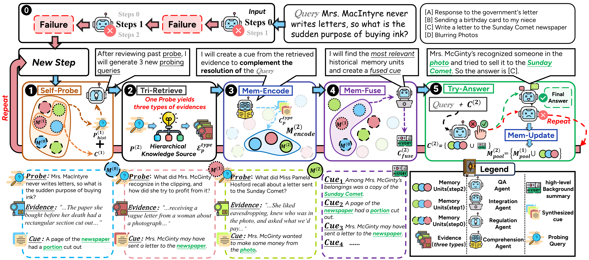

<h1 align="center">ComoRAG: A Cognitive-Inspired Memory-Organized RAG for Stateful Long Narrative Reasoning</h1>
<div align="center">

[](https://www.python.org/) [](https://developer.nvidia.com/cuda-zone) [](https://kernel.org/) [](#project-introduction) [](#main-modules) [](#) [](https://arxiv.org/abs/2508.10419) [](LICENSE) [](https://deepwiki.com/EternityJune25/ComoRAG)

[English](README.md) | [中文](README_zh.md)

</div>

<p align="center">
  
</p>

## 📖 Paper Information

This is the **official implementation** of the paper:

**[ComoRAG: A Cognitive-Inspired Memory-Organized RAG for Stateful Long Narrative Reasoning](https://arxiv.org/abs/2508.10419)**


**Citation:**
```bibtex
@article{wang2025comorag,
  title={ComoRAG: A Cognitive-Inspired Memory-Organized RAG for Stateful Long Narrative Reasoning},
  author={Wang, Juyuan and Zhao, Rongchen and Wei, Wei and Wang, Yufeng and Yu, Mo and Zhou, Jie and Xu, Jin and Xu, Liyan},
  journal={arXiv preprint arXiv:2508.10419},
  year={2025}
}
```

---

## Project Introduction
ComoRAG is a retrieval-augmented generation (RAG) framework designed for long-document and multi-document tasks, including question answering, information extraction, and knowledge graph construction. It integrates large language models, embedding techniques, graph-based reasoning, and evaluation methodologies, making it suitable for both academic research and real-world applications.

🔥 What makes ComoRAG different?

Narrative comprehension on long stories and novels is hard due to intricate plotlines and evolving character/entity relations. LLMs struggle with extended context and cost, so retrieval stays crucial. However, classic RAG is often stateless and single-step, missing the dynamic nature of long-range, interconnected reasoning.

ComoRAG takes a cognition-inspired approach: narrative reasoning is not one-shot, but a dynamic, evolving interplay between new evidence acquisition and consolidation of past knowledge — analogous to memory processes in the brain. 🧠

- 🔁 Iterative Reasoning Cycles: When hitting an impasse, ComoRAG launches cycles that interact with a dynamic memory workspace.
- 🕵️ Probing Queries: Each cycle generates targeted probes to explore new evidence paths.
- 🧳 Global Memory Pool: Newly retrieved evidence is integrated into a shared memory pool to progressively build coherent context for the query.

🚀 Benchmarks & Gains: On four challenging long-context narrative benchmarks (200K+ tokens), ComoRAG outperforms strong RAG baselines with consistent relative gains up to 11% over the strongest baseline. It particularly shines on complex queries requiring global comprehension, enabling principled, cognitively motivated, stateful retrieval-based reasoning. 📈

Key idea in one line: Reason → Probe → Retrieve → Consolidate → Resolve. 🧩

---

## Key Features ✨
- 🧠 Support for various LLMs and local/remote embedding models
- 🕸️ Graph-augmented retrieval and reasoning
- 🔧 Flexible data preprocessing and chunking
- 📊 Multiple evaluation metrics (F1, EM, etc.)
- 🧱 Modular and extensible design

---

## Directory Structure 📂
```
ComoRAG/
├── main_openai.py                       # Main program using OpenAI API
├── main_vllm.py                         # Main program using local vLLM server
├── script/                              # Data processing and evaluation scripts
│   ├── chunk_doc_corpus.py              # Document chunking script
│   └── eval_qa.py                       # QA evaluation script
├── dataset/                             # Dataset directory
│   └── ...
├── src/comorag/                        # Core code
│   ├── ComoRAG.py                       # Main class and core logic
│   ├── utils/                           # Utility modules
│   ├── embedding_model/                 # Embedding model related
│   ├── llm/                             # LLM related
│   ├── prompts/                         # Prompt templates
│   ├── information_extraction/          # Information extraction
│   └── rerank.py, embedding_store.py    # Other core modules
├── requirements.txt                     # Dependencies
└── README.md                            # Project documentation
```

---

## Installation & Environment 🛠️
1. 🐍 **Python version**: Python 3.10 or above recommended
2. 📦 **Install dependencies**:
```bash
pip install -r requirements.txt
```
3. 🔑 **Environment variables**: Set your OpenAI API Key or local LLM/embedding paths as needed
4. ⚙️ **GPU (optional but recommended)**: CUDA 12.x supported by many dependencies in requirements.txt

---

## Data Preparation & Format 📄
- 📚 **Corpus file corpus.jsonl**: Each line is a document, with fields like `id`, `doc_id`, `title`, `contents`
- ❓ **QA file qas.jsonl**: Each line is a question, with fields like `id`, `question`, `golden_answers`

Example:

corpus.jsonl:
```json
{"id": 0, "doc_id": 1, "title": "...", "contents": "..."}
```
qas.jsonl:
```json
{"id": "1", "question": "...", "golden_answers": ["..."]}
```

---

## Quick Start ⚡

### Method 1: Using OpenAI API (main_openai.py) 🚀

1. Configure dataset path and model parameters in the script:
```python
config = BaseConfig(
    llm_base_url='https://api.example.com/v1',  # OpenAI API
    llm_name='gpt-4o-mini',
    dataset='cinderella',
    embedding_model_name='/path/to/your/embedding/model',
    embedding_batch_size=32,
    need_cluster=True,  # Enable Semantic/Episodic enhancement
    output_dir='result/cinderella',
    save_dir='outputs/cinderella',
    max_meta_loop_max_iterations=5,
    is_mc=False,  # Multiple-choice?
    max_tokens_ver=2000,  # Veridical layer tokens
    max_tokens_sem=2000,  # Semantic layer tokens
    max_tokens_epi=2000   # Episodic layer tokens
)
```
2. Run the main program ▶️:
```bash
python main_openai.py
```

### Method 2: Using Local vLLM Server (main_vllm.py) ⚡

#### 1. Start vLLM Server 🚀

First, start the vLLM OpenAI-compatible API server:

```bash
# Method 1: Using vllm serve command
vllm serve /path/to/your/model \
  --tensor-parallel-size 1 \
  --max-model-len 4096 \
  --gpu-memory-utilization 0.95

# Method 2: Using python -m vllm.entrypoints.openai.api_server
python -m vllm.entrypoints.openai.api_server \
  --model /path/to/your/model \
  --served-model-name your-model-name \
  --tensor-parallel-size 1 \
  --max-model-len 32768 \
  --dtype auto
```

**Parameter descriptions:**
- `--model`: Model path (e.g., `/path/to/your/model`)
- `--tensor-parallel-size`: Number of GPU parallel processes
- `--max-model-len`: Maximum model length
- `--gpu-memory-utilization`: GPU memory utilization rate

#### 2. Configure main_vllm.py 📝

Modify the configuration in `main_vllm.py`:

```python
# vLLM server configuration
vllm_base_url = 'http://localhost:8000/v1'  # vLLM server address
served_model_name = '/path/to/your/model'    # Model path

config = BaseConfig(
    llm_base_url=vllm_base_url,
    llm_name=served_model_name,
    llm_api_key="your-api-key-here",  # Any value, local server doesn't need real API key
    dataset='cinderella',
    embedding_model_name='/path/to/your/embedding/model',
    embedding_batch_size=4,
    need_cluster=True,
    output_dir='result/cinderella_vllm',
    save_dir='outputs/cinderella_vllm',
    max_meta_loop_max_iterations=5,
    is_mc=False,
    max_tokens_ver=2000,
    max_tokens_sem=2000,
    max_tokens_epi=2000
)
```

#### 3. Run the Program ▶️

```bash
python main_vllm.py
```

#### 4. Check Server Status 🔍

Ensure the vLLM server is running properly:

```bash
# Check if port is occupied
netstat -tlnp | grep 8000

# Test API connection
curl http://localhost:8000/v1/models
```

### Method 3: Using Local docker compose deployment (main_docker.py) ⚡
This method deploys everything needed locally. Namely:
1. vLLM openai server for language model inference
2. 🤗 HugginFace's Text Embeddings Inference (HF TEI)
3. como-app

#### Requirements
- docker
- nvidia device plugin

#### 1. Configure inference services 📝

```bash
cp .env.example .env
```
After cpoying the example environment file adjust environment variables as wanted.

#### 2. Pull, build and spin-up docker compose deployment

```bash
docker compose up -d && docker compose logs -f
```

#### 4. Check Deployment Services' Status 🔍
Following the deployment of the application stack. Both HF TEI and vllm need to download models.

The `como-app` is only started once both these are up and running healthy.
```logs
[+] Running 3/3
 ✔ Container comorag-vllm-1      Healthy                                                                                                                                                                         1.0s
 ✔ Container embeddings          Healthy                                                                                                                                                                        16.0s
 ✔ Container comorag-como-app-1  Started
 ```

##### Check HF TEI logs
```bash
docker compose logs -f embeddings
```

Wait until you see the following:
```logs
...
embeddings  | 2025-08-18T16:20:13.621603Z  INFO text_embeddings_router: router/src/lib.rs:239: Starting model backend
embeddings  | 2025-08-18T16:20:13.623965Z  INFO text_embeddings_backend: backends/src/lib.rs:516: Downloading `model.safetensors`
embeddings  | 2025-08-18T16:20:13.624022Z  INFO text_embeddings_backend: backends/src/lib.rs:395: Model weights downloaded in 63.05µs
embeddings  | 2025-08-18T16:20:13.998327Z  INFO text_embeddings_backend_candle: backends/candle/src/lib.rs:412: Starting FlashNomicBert model on Cuda(CudaDevice(DeviceId(1)))
embeddings  | 2025-08-18T16:20:23.549330Z  INFO text_embeddings_router: router/src/lib.rs:257: Warming up model
embeddings  | 2025-08-18T16:20:23.945749Z  INFO text_embeddings_router::http::server: router/src/http/server.rs:1852: Starting HTTP server: 0.0.0.0:8080
embeddings  | 2025-08-18T16:20:23.945762Z  INFO text_embeddings_router::http::server: router/src/http/server.rs:1853: Ready
```

##### Check vLLM logs
```bash
docker compose logs -f vllm
```

Wait until you see the following:
```logs
...
vllm-1  | INFO 08-18 09:29:55 [api_server.py:1818] Starting vLLM API server 0 on http://0.0.0.0:80
vllm-1  | INFO 08-18 09:29:55 [launcher.py:29] Available routes are:
vllm-1  | INFO 08-18 09:29:55 [launcher.py:37] Route: /openapi.json, Methods: HEAD, GET
vllm-1  | INFO 08-18 09:29:55 [launcher.py:37] Route: /docs, Methods: HEAD, GET
vllm-1  | INFO 08-18 09:29:55 [launcher.py:37] Route: /docs/oauth2-redirect, Methods: HEAD, GET
vllm-1  | INFO 08-18 09:29:55 [launcher.py:37] Route: /redoc, Methods: HEAD, GET
vllm-1  | INFO 08-18 09:29:55 [launcher.py:37] Route: /health, Methods: GET
vllm-1  | INFO 08-18 09:29:55 [launcher.py:37] Route: /load, Methods: GET
vllm-1  | INFO 08-18 09:29:55 [launcher.py:37] Route: /ping, Methods: POST
vllm-1  | INFO 08-18 09:29:55 [launcher.py:37] Route: /ping, Methods: GET
vllm-1  | INFO 08-18 09:29:55 [launcher.py:37] Route: /tokenize, Methods: POST
vllm-1  | INFO 08-18 09:29:55 [launcher.py:37] Route: /detokenize, Methods: POST
vllm-1  | INFO 08-18 09:29:55 [launcher.py:37] Route: /v1/models, Methods: GET
vllm-1  | INFO 08-18 09:29:55 [launcher.py:37] Route: /version, Methods: GET
vllm-1  | INFO 08-18 09:29:55 [launcher.py:37] Route: /v1/responses, Methods: POST
vllm-1  | INFO 08-18 09:29:55 [launcher.py:37] Route: /v1/responses/{response_id}, Methods: GET
vllm-1  | INFO 08-18 09:29:55 [launcher.py:37] Route: /v1/responses/{response_id}/cancel, Methods: POST
vllm-1  | INFO 08-18 09:29:55 [launcher.py:37] Route: /v1/chat/completions, Methods: POST
vllm-1  | INFO 08-18 09:29:55 [launcher.py:37] Route: /v1/completions, Methods: POST
vllm-1  | INFO 08-18 09:29:55 [launcher.py:37] Route: /v1/embeddings, Methods: POST
vllm-1  | INFO 08-18 09:29:55 [launcher.py:37] Route: /pooling, Methods: POST
vllm-1  | INFO 08-18 09:29:55 [launcher.py:37] Route: /classify, Methods: POST
vllm-1  | INFO 08-18 09:29:55 [launcher.py:37] Route: /score, Methods: POST
vllm-1  | INFO 08-18 09:29:55 [launcher.py:37] Route: /v1/score, Methods: POST
vllm-1  | INFO 08-18 09:29:55 [launcher.py:37] Route: /v1/audio/transcriptions, Methods: POST
vllm-1  | INFO 08-18 09:29:55 [launcher.py:37] Route: /v1/audio/translations, Methods: POST
vllm-1  | INFO 08-18 09:29:55 [launcher.py:37] Route: /rerank, Methods: POST
vllm-1  | INFO 08-18 09:29:55 [launcher.py:37] Route: /v1/rerank, Methods: POST
vllm-1  | INFO 08-18 09:29:55 [launcher.py:37] Route: /v2/rerank, Methods: POST
vllm-1  | INFO 08-18 09:29:55 [launcher.py:37] Route: /scale_elastic_ep, Methods: POST
vllm-1  | INFO 08-18 09:29:55 [launcher.py:37] Route: /is_scaling_elastic_ep, Methods: POST
vllm-1  | INFO 08-18 09:29:55 [launcher.py:37] Route: /invocations, Methods: POST
vllm-1  | INFO 08-18 09:29:55 [launcher.py:37] Route: /metrics, Methods: GET
vllm-1  | INFO:     Started server process [1]
vllm-1  | INFO:     Waiting for application startup.
vllm-1  | INFO:     Application startup complete.
```

##### ComoRAG
Now attach to the como-app to see its logs.
```bash
docker compose logs -f como-app
```

For example:
```logs
```

### Comparison of Two Methods 📊

| Feature | OpenAI API (main.py) | vLLM Local (main_vllm.py) |
|---------|---------------------|---------------------------|
| Cost | Pay per token | One-time model download |
| Speed | Network latency | Local inference, faster |
| Privacy | Data sent to cloud | Completely local processing |
| Setup | Simple, just API key | Requires GPU and model files |
| Stability | Network dependent | Local control |

3. 📁 Results will be saved under `result/<dataset>/<subset>/`

---

## Main Modules
- 🏛️ `ComoRAG.py`: The main class, responsible for retrieval, graph construction, reasoning, and QA
- 🧰 `utils/`: Configuration, logging, embedding, clustering, summarization, memory, agents, and other utilities
- 🧲 `embedding_model/`: Embedding model adaptation and loading
- 🤖 `llm/`: LLM adaptation
- 🗒️ `prompts/`: Prompt template management
- 📦 `embedding_store.py`: Embedding vector storage and retrieval

---

## Data Processing & Evaluation Scripts 🧪
- ✂️ `script/chunk_doc_corpus.py`: Document chunking, supports token/word/sentence/recursive methods
- 📈 `script/eval_qa.py`: Automatic QA result evaluation, supports EM, F1, and other metrics

Example usage:

Chunking documents ✂️:
```bash
python script/chunk_doc_corpus.py \
  --input_path dataset/<name>/<subset>/corpus.jsonl \
  --output_path dataset/<name>/<subset>/corpus_chunked.jsonl \
  --chunk_by token \
  --chunk_size 512 \
  --tokenizer_name_or_path /path/to/your/tokenizer
```

Evaluate QA results 📊:
```bash
python script/eval_qa.py /path/to/result/<dataset>/<subset>
```
This produces files like ``details`、`results.json`, etc.

---

## Contact & Contribution 🤝
For questions or suggestions, feel free to submit an Issue or PR.

---

## Acknowledgement 🙏
We refer to the repository of [HippoRAG](https://github.com/OSU-NLP-Group/HippoRAG) as a skeleton code.
