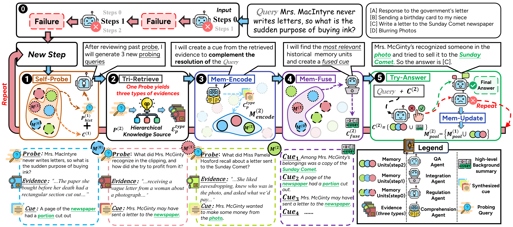

<h1 align="center">ComoRAG</h1>
<div align="center">

[](https://www.python.org/) [](https://developer.nvidia.com/cuda-zone) [](https://kernel.org/) [](#项目介绍) [](#主要模块) [](#) [](https://arxiv.org/abs/2508.10419) [](LICENSE) [](https://deepwiki.com/EternityJune25/ComoRAG)

[English](README.md) | [中文](README_zh.md)

</div>

<p align="center">
  
</p>

## 📖 论文信息

这是以下论文的**官方实现**：

**[ComoRAG: A Cognitive-Inspired Memory-Organized RAG for Stateful Long Narrative Reasoning](https://arxiv.org/abs/2508.10419)**


**引用：**
```bibtex
@article{wang2025comorag,
  title={ComoRAG: A Cognitive-Inspired Memory-Organized RAG for Stateful Long Narrative Reasoning},
  author={Wang, Juyuan and Zhao, Rongchen and Wei, Wei and Wang, Yufeng and Yu, Mo and Zhou, Jie and Xu, Jin and Xu, Liyan},
  journal={arXiv preprint arXiv:2508.10419},
  year={2025}
}
```

---

## 项目介绍
ComoRAG是一个用于长文档和多文档问答、信息提取和知识图谱构建的检索增强生成（RAG）系统。它集成了各种LLM、嵌入模型、基于图的推理和评估工具，适用于研究和实际应用。

🔥 ComoRAG有什么不同？

由于复杂的故事情节和不断演化的角色/实体关系，长故事和小说中的叙事理解很困难。LLM在扩展上下文和成本方面存在困难，因此检索仍然至关重要。然而，经典的RAG通常是无状态和单步的，错过了长距离、相互关联推理的动态性质。

ComoRAG采用认知启发的方法：叙事推理不是一次性的，而是新证据获取和过去知识整合之间的动态、演化的相互作用——类似于大脑中记忆过程的类比。🧠

- 🔁 迭代推理循环：当遇到推理障碍时，ComoRAG启动与动态记忆工作空间交互的循环。
- 🕵️ 探测查询：每个循环生成有针对性的探测，以探索新的证据路径。
- 🧳 全局记忆池：新检索的证据被整合到共享记忆池中，逐步为查询构建连贯的上下文。

🚀 基准测试和收益：在四个具有挑战性的长上下文叙事基准测试（200K+ tokens）上，ComoRAG优于强大的RAG基线，与最强基线相比，相对收益高达11%。它在需要全局理解的复杂查询上特别出色，为基于检索的长上下文理解提供了原则性的、认知动机的、有状态的推理。📈

一句话概括核心思想：推理 → 探测 → 检索 → 整合 → 解决。🧩

---

## 主要特性 ✨
- 🧠 支持多种 LLM 及本地/远程嵌入模型
- 🕸️ 图结构增强的检索与推理
- 🔧 灵活的数据预处理与分块
- 📊 多种评测指标（EM、F1 等）
- 🧱 模块化、易扩展设计

---

## 目录结构 📂
```
ComoRAG/
├── main_openai.py                       # 使用 OpenAI API 的主程序
├── main_vllm.py                         # 使用本地 vLLM 服务器的主程序
├── script/                              # 数据处理与评测脚本
│   ├── chunk_doc_corpus.py              # 文档分块脚本
│   └── eval_qa.py                       # 问答评测脚本
├── dataset/                             # 数据集目录
│   └── ...
├── src/comorag/                        # 核心代码
│   ├── ComoRAG.py                       # 主类与核心逻辑
│   ├── utils/                           # 工具模块
│   ├── embedding_model/                 # 嵌入模型相关
│   ├── llm/                             # LLM 相关
│   ├── prompts/                         # 提示词模板
│   ├── information_extraction/          # 信息抽取
│   └── rerank.py, embedding_store.py    # 其他核心模块
├── requirements.txt                     # 依赖包
└── README.md / README_zh.md             # 项目说明
```

---

## 安装与环境配置 🛠️
1. 🐍 **Python 版本**：建议 Python 3.10 及以上
2. 📦 **依赖安装**：
```bash
pip install -r requirements.txt
```
3. 🔑 **环境变量**：根据需要设置 OpenAI API Key 或本地 LLM/嵌入模型路径
4. ⚙️ **GPU（可选但推荐）**：requirements.txt 中多项依赖支持 CUDA 12.x

---

## 数据准备与格式 📄
- 📚 **语料文件 corpus.jsonl**：每行一个文档，字段如 `id`, `doc_id`, `title`, `contents`
- ❓ **问答文件 qas.jsonl**：每行一个问题，字段如 `id`, `question`, `golden_answers`

示例：

corpus.jsonl:
```json
{"id": 0, "doc_id": 1, "title": "...", "contents": "..."}
```
qas.jsonl:
```json
{"id": "1", "question": "...", "golden_answers": ["..."]}
```

---

## 快速开始 ⚡

### 方法一：使用 OpenAI API（main_openai.py）🚀

1. 在脚本中配置数据集路径和模型参数
```python
config = BaseConfig(
    llm_base_url='https://api.example.com/v1',  # OpenAI API
    llm_name='gpt-4o-mini',
    dataset='cinderella',
    embedding_model_name='/path/to/your/embedding/model',
    embedding_batch_size=32,
    need_cluster=True,  # 启用语义/情节增强
    output_dir='result/cinderella',
    save_dir='outputs/cinderella',
    max_meta_loop_max_iterations=5,  # 最大迭代次数
    is_mc=False,  # 是否选择题
    max_tokens_ver=2000,  # 验证层最大token数
    max_tokens_sem=2000,  # 语义层最大token数
    max_tokens_epi=2000   # 情节层最大token数
)
```
2. 运行主程序 ▶️：
```bash
python main_openai.py
```

### 方法二：使用本地 vLLM 服务器（main_vllm.py）⚡

#### 1. 启动 vLLM 服务器 🚀

首先启动 vLLM OpenAI 兼容的 API 服务器：

```bash
# 方式一：使用 vllm serve 命令
vllm serve /path/to/your/model \
  --tensor-parallel-size 1 \
  --max-model-len 4096 \
  --gpu-memory-utilization 0.95

# 方式二：使用 python -m vllm.entrypoints.openai.api_server
python -m vllm.entrypoints.openai.api_server \
  --model /path/to/your/model \
  --served-model-name your-model-name \
  --tensor-parallel-size 1 \
  --max-model-len 32768 \
  --dtype auto
```

**参数说明：**
- `--model`：模型路径（如 `/path/to/your/model`）
- `--tensor-parallel-size`：GPU 并行数量
- `--max-model-len`：最大模型长度
- `--gpu-memory-utilization`：GPU 内存使用率

#### 2. 配置 main_vllm.py 📝

修改 `main_vllm.py` 中的配置：

```python
# vLLM 服务器配置
vllm_base_url = 'http://localhost:8000/v1'  # vLLM 服务器地址
served_model_name = '/path/to/your/model'    # 模型路径

config = BaseConfig(
    llm_base_url=vllm_base_url,
    llm_name=served_model_name,
    llm_api_key="your-api-key-here",  # 任意值，本地服务器不需要真实 API key
    dataset='cinderella',
    embedding_model_name='/path/to/your/embedding/model',
    embedding_batch_size=4,
    need_cluster=True,
    output_dir='result/cinderella_vllm',
    save_dir='outputs/cinderella_vllm',
    max_meta_loop_max_iterations=5,
    is_mc=False,
    max_tokens_ver=2000,
    max_tokens_sem=2000,
    max_tokens_epi=2000
)
```

#### 3. 运行程序 ▶️

```bash
python main_vllm.py
```

#### 4. 检查服务器状态 🔍

确保 vLLM 服务器正常运行：

```bash
# 检查端口是否被占用
netstat -tlnp | grep 8000

# 测试 API 连接
curl http://localhost:8000/v1/models
```

### 两种方法的区别 📊

| 特性 | OpenAI API (main_openai.py) | vLLM 本地 (main_vllm.py) |
|------|---------------------|-------------------------|
| 成本 | 按 token 收费 | 一次性模型下载 |
| 速度 | 网络延迟 | 本地推理，更快 |
| 隐私 | 数据发送到云端 | 完全本地处理 |
| 配置 | 简单，只需 API key | 需要 GPU 和模型文件 |
| 稳定性 | 依赖网络 | 本地控制 |

3. 📁 结果将保存在 `result/` 目录下

---

## 主要模块说明
- 🏛️ `ComoRAG.py`：系统主类，负责检索、构建、推理与问答
- 🧰 `utils/`：配置、日志、嵌入、聚类、摘要、记忆、智能体等工具
- 🧲 `embedding_model/`：嵌入模型适配与加载
- 🤖 `llm/`：大语言模型适配
- 🗒️ `prompts/`：提示词模板管理
- 📦 `embedding_store.py`：嵌入向量存储与检索

---

## 数据处理与评测脚本 🧪
- ✂️ `script/chunk_doc_corpus.py`：文档分块，支持按 token/句子/递归等方式
- 📈 `script/eval_qa.py`：自动评测问答结果，支持 EM、F1 等指标

使用示例：

文档分块 ✂️：
```bash
python script/chunk_doc_corpus.py \
  --input_path dataset/<name>/<subset>/corpus.jsonl \
  --output_path dataset/<name>/<subset>/corpus_chunked.jsonl \
  --chunk_by token \
  --chunk_size 512 \
  --tokenizer_name_or_path /path/to/your/tokenizer
```

评测问答结果 📊：
```bash
python script/eval_qa.py /path/to/result/<dataset>/<subset>
```
将生成 `details`、`results.json` 等文件。

---

## 联系与贡献 🤝
如有问题或建议，欢迎提交 Issue 或 PR。

---

## 致谢
本项目参考了 [HippoRAG](https://github.com/OSU-NLP-Group/HippoRAG) 仓库的骨架代码。

---

## Star History ⭐

[](https://star-history.com/#OSU-NLP-Group/ComoRAG&Date)
